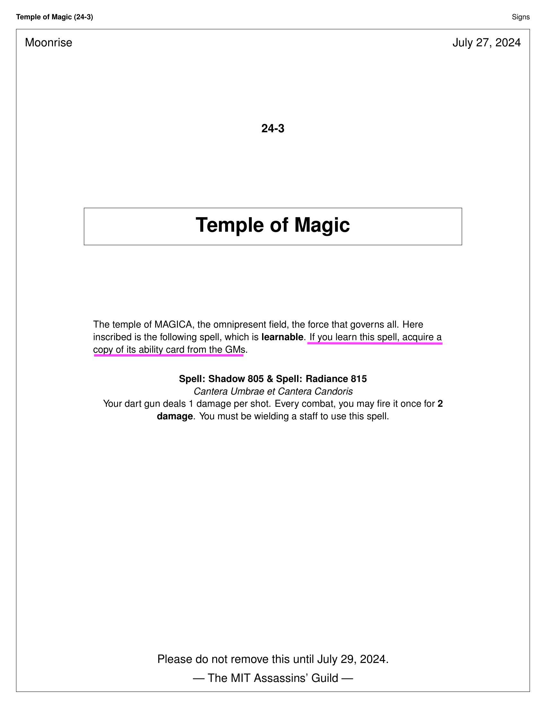
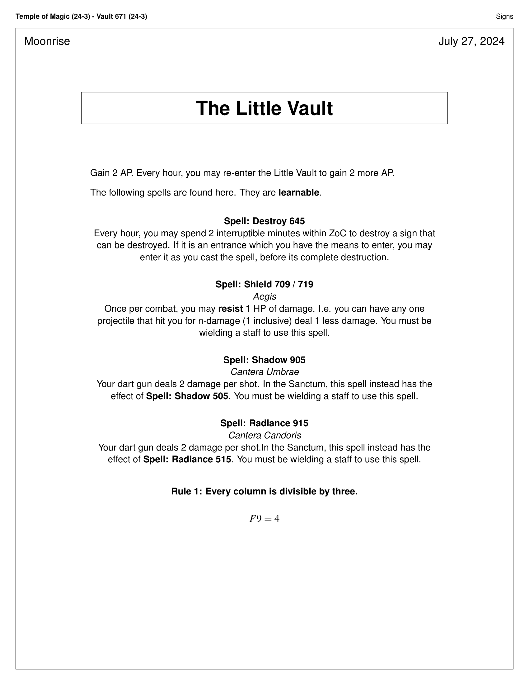
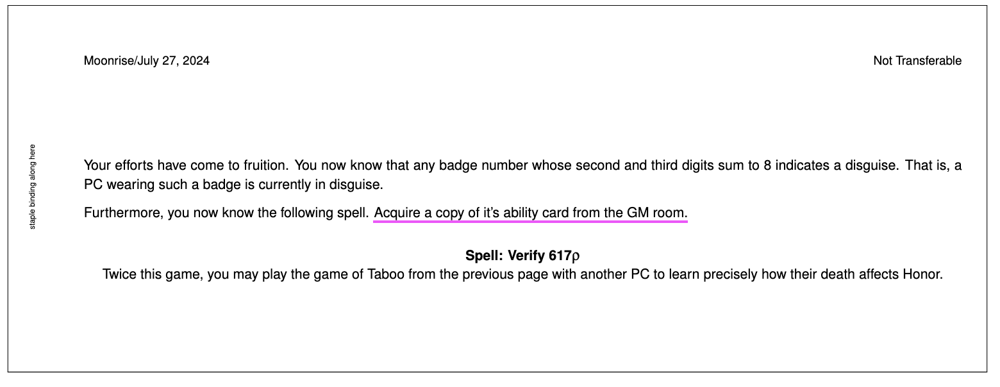
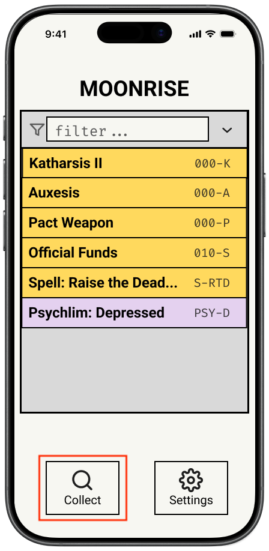
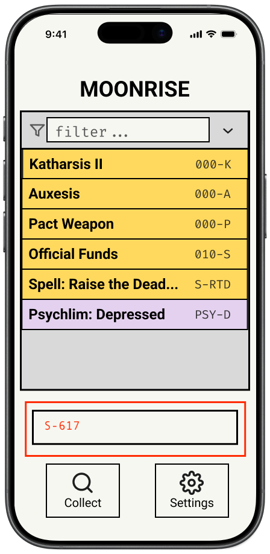
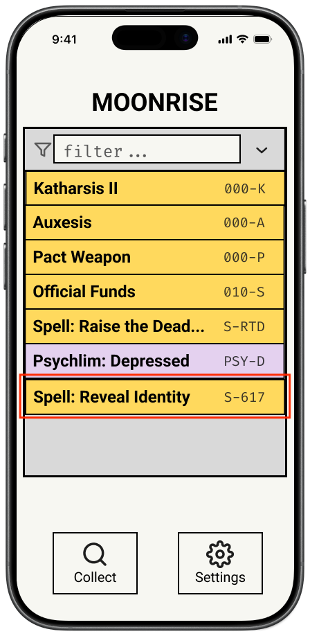
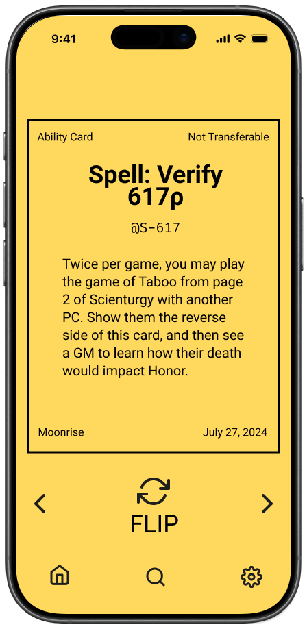
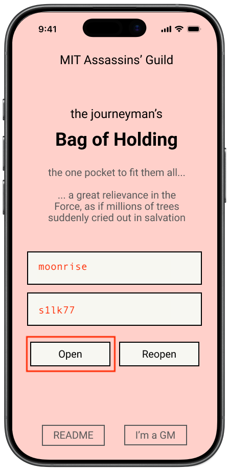

# Bag of Holding <sub>6.1040</sub>

_Tired of holding 50 pieces of paper in your sweaty hands and emptying out four pockets worth of stuff just for that one elusive ability card you really wished you knew where you put? Fear no more. The Wizard of the Court hath forth with an offering. A Bag of Holding, if you may. The price, you ask? Only that you use your powers for good and **never for evil.**_

---

Live action roleplay (LARP) claims its standing as a one-of-a-kind genre in the cosmos of games for it being so incredibly immersive. LARP games put you right into their world, physically, using a combination of cleverly demarcated real-life spaces and the vast remainder of your imagination. Here at [MIT Assassins' Guild](https://assassin.mit.edu/web/Who_are_we%3F), our signature LARP style is the information-dense, mechanics-heavy "secrets & powers" games. These games can feature a novel's worth of text, with up to hundreds of items, player abilities, puzzle clues, etc. Traditionally, game pieces like abilities are packaged as card-sized physical cutouts, which have not only been labor intensive to produce, but also adversarial to pocket space and difficult to inventory. Puzzle clues are even more laborious, often requiring a player to manually copy the clue text into their notes. This can get frustrating, especially when a game is ten days long...

_Bag of Holding_ is an attempt to convert a universal gadget we call the phone into a digital pocket for your ability cards. It won't be as cool as the physcial ones, we know, but we hope to get as close as we can while saving you all the trouble!

Here in this wonderous Bag, you can:

- **Collect** the goodies you find in game by entering their _lookup code_ and retrieving a digital copy of your rewards! They stay with you as long as you log back in with the same player name.
- **Filter** your abilities (and potentially other things) by name! See them all in a list so you can find them fast!
- **Display** any of your abilities as a card on your screen, which you can flip over and show other players just like you would normally!

And for you lovely GMs:

- All you have to do is create a game and upload your abilities into the Bag with whatever lookup codes _you_ designate so our behind-the-stage magic can find them again in the demiplane when your players ask!

\*Note: batch uploads from [GameTeX](https://web.mit.edu/kenclary/Public/Guild/GameTeX/) will (aim to) be supported if Ken Clary has time in the next three weeks.

## Why the Bag? <sub>User Journey</sub>

So you might have encountered a sign that told you this:



Or this:



Or maybe when you had finally completed your glorious evolution and opened the last page of your notebook...



You're 3 buildings away and busy unlocking the powers of the universe, thank you very much.

But now, armed with your personalized Bag of Holding, this is what your trip to the GM room looks like:

**Step 1: Click button**



**Step 2: Enter lookup code**

\*If the GMs wrote their game correctly, the game will tell you what the code is.



**Step 3: Profit**

<p>


</p>

Notice how you did 0 walking and got ahold of your cookie much, much faster? All you need is your phone and the internet, which lucky for you is supported everywhere at MIT!

The Bag is super easy to acquire too. It's completely free, unlike all those MacGuffins you have to battle your opponents for. Just go to `[placeholder-link]`, type in a (GM provided) game code, pick any player name you choose, and the Bag is yours!



[I'm a GM, how do I set this up?](/documentations/GM-demo.md)

## Repository Structure

```
/
|- README.md
|- documentations/
|  |- images/
|  |  |- ...
|  |- concept-design.md
|  |- UI-design.md
|  |- HLDD.md
```

## High Level Design Doc

[Problem Framing & Stakeholders](/documentations/HLDD.md)

## Concept Specifications

## UI Sketches

[UI Designs](design/UI-design.md)
