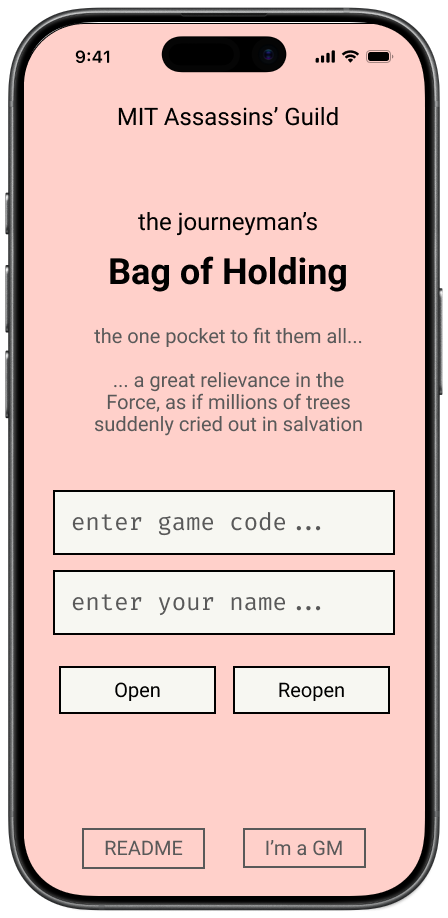
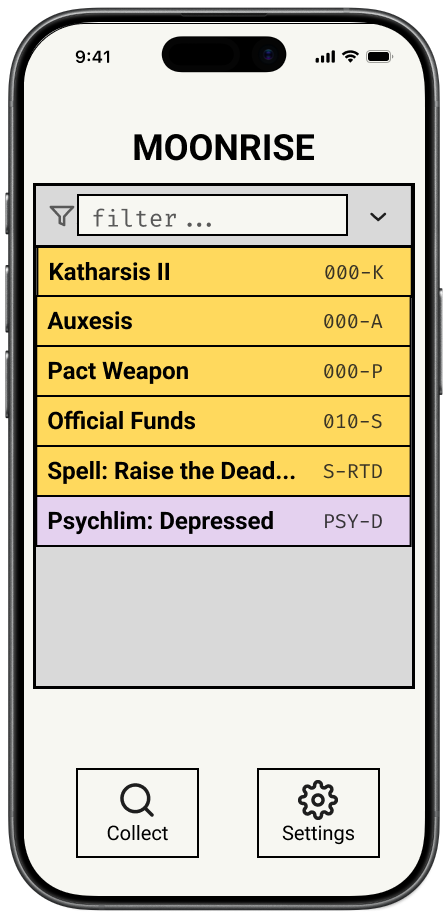
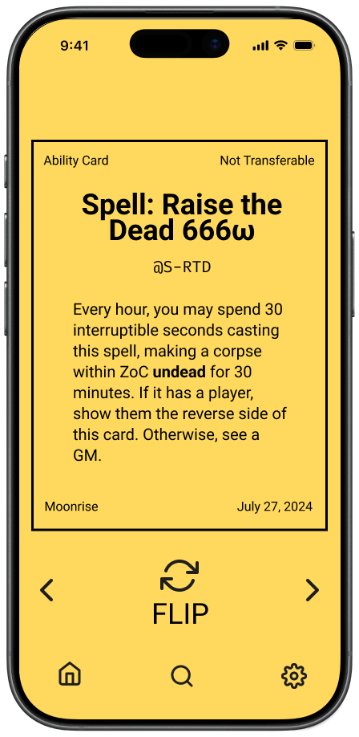
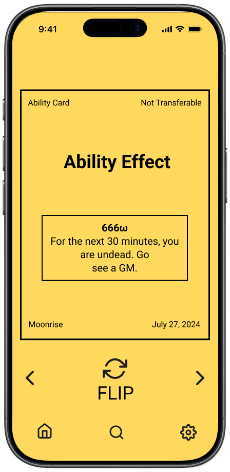
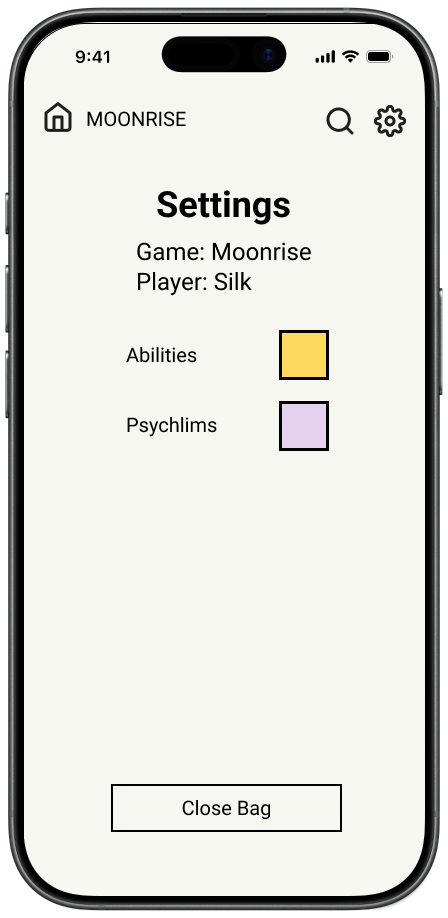
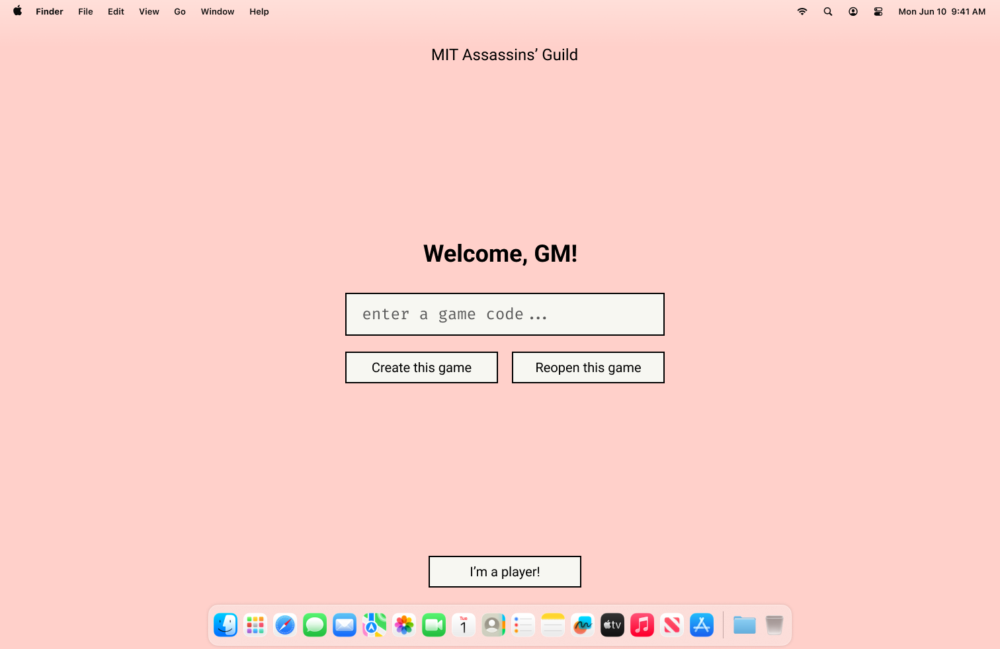
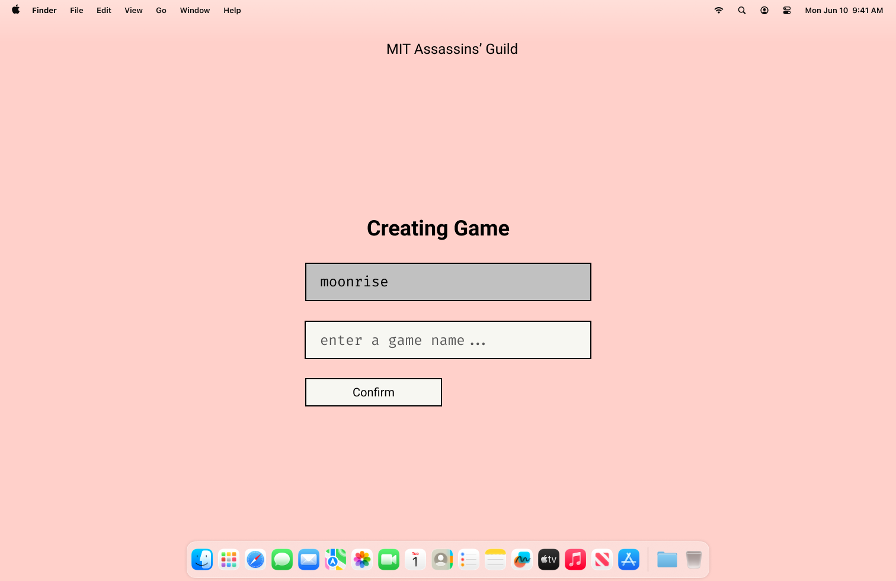
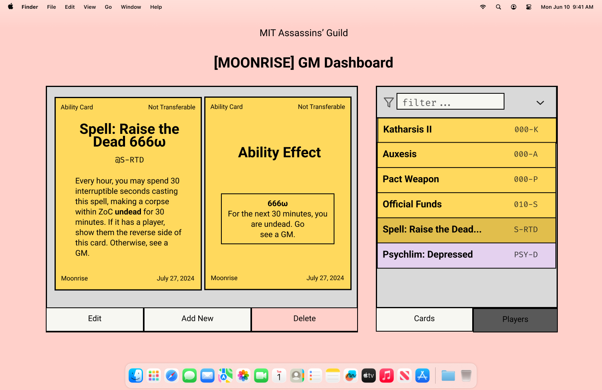
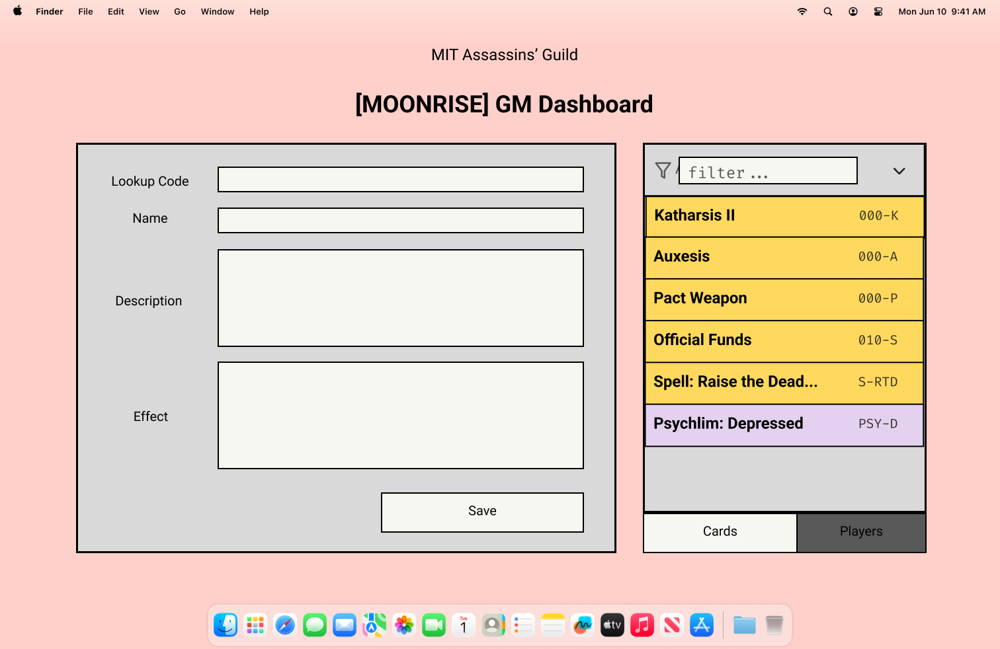

# UI Design

[Figma Link](https://www.figma.com/design/4XIR3zx44VsYUQEjg9iP4k/Bag-of-Holding?node-id=29-509&t=9z3p0ZT9ZUZGg5kf-1)

## Player Side

- Mobile first. Perhaps even mobile only. Assumed players are accessing this app on mobile.
- Minimalist. We are not here to be fancy, it is important we do not distract players from the physical game.
- GameTeX formatting. Ability cards should look like GameTeX-printed cards, we are mirroring the real thing.

### Join Screen

### Player Home Screen

### Collect

### Ability Card Display

    
    

### \[Stretch Goal\] Settings

Player can change the Ability Card display color by clicking on the colored square next to "Ability." Commonly used colors in the Guild are yellow and pink, and it would be nice to offer more options than just yellow.

## GM Side

- Laptop first. We assume GMs are accessing this app on wide screens.
- MVP

### GM Home Page & Game Creation

### Dashboard (Viewing)

### Dashboard (Editing)

