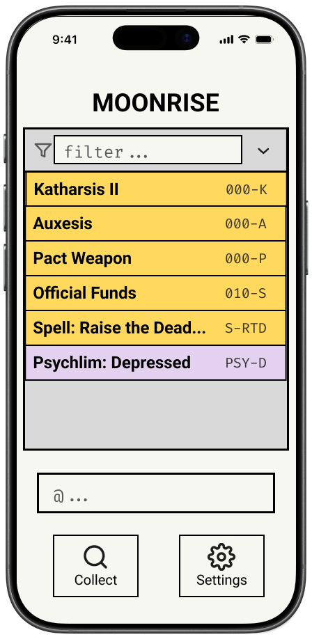

# UI Design

[Figma Link](https://www.figma.com/design/4XIR3zx44VsYUQEjg9iP4k/Bag-of-Holding?node-id=29-509&t=9z3p0ZT9ZUZGg5kf-1)

## Player Side

- Mobile first. Perhaps even mobile only. Assumed players are accessing this app on mobile.
- Minimalist. We are not here to be fancy, it is important we do not distract players from the physical game.
- GameTeX formatting. Ability cards should look like GameTeX-printed cards, we are mirroring the real thing.

### Join Screen

This is the player join screen and the initial render. A player can enter a gamecode and a name, then select "Open" to join for the first time or "Reopen" to rejoin. The former checks that the entered name does not exist and the latter checks that it does. A GM navigates from this page to the GM home screen.

### Player Home Screen

Player homescreen displaying a list of abilities with their names (left) and lookup codes (right). Each entry can be clicked to open its corresponding display view. The <b>Collect</b> button opens the collect panel, and the <b>Settings</b> button opens the settings page. Players can filter abilities list by typing in key strings.

### Collect

Player can type lookup codes into the @ search bar and add new abilities.

### Ability Card Display

    
    
    GameTeX accurate, flippable ability card. Left and right arrows index through the ability list. Navigation bar on the bottom for returning to home, opening the Collect panel, and opening the settings page.

### \[Stretch Goal\] Settings

Player can change the Ability Card display color by clicking on the colored square next to "Ability." Commonly used colors in the Guild are yellow and pink, and it would be nice to offer more options than just yellow.

## GM Side

- Laptop first. We assume GMs are accessing this app on wide screens.
- MVP

### GM Home Page & Game Creation

GM can choose to create game or reopen game.

If creating game, GMs provide a game name and click confirm. (Maybe make editable.)

### Dashboard (Viewing)

Clicking on individual entries in the ability list brings it up in the preview. GMs have a choice to edit the currently displayed ability, add a new one, or delete the currently displayed ability.

### Dashboard (Editing)

