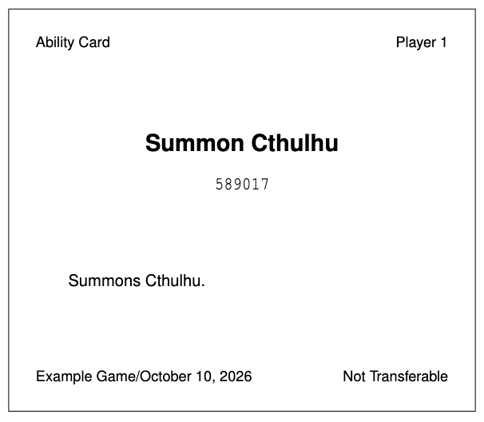

# Bag of Holding - GM Guide

Open Bag of Holding on a laptop (wide screen), and click the "I'm a GM" button to open the GM interface.


## Creating a Game

1. Enter any alphanumeric game code and click "Create this game." (If your game code is already taken, you will be prompted to change it.)
2. Pick a name for your game and confirm.


## The Dashboard


- A list of lookup-supported items appears in the right panel. There is a alternate tab to see a list of players.
- When you click on a list entry, a preview of its content displays on the left panel
  - Click "Edit" to edit its contents
  - Click "Add New" to add a new entry
  - Click "Delete" to delete the current entry

## How do I write a game with Bag support?

Mostly, you just need to make sure that anywhere your game mentions something that has a lookup code, it also mentions the code. For example:

> You just unlocked ability Summon Cthulhu! (lookup: 589017)

If you'd like a better user interface to manage lookup codes than our GM Dashboard (which we admit is not as good as say, Google Sheets), you could keep your own tabs. Also, if you're any comfortable with the LaTeX part of GameTeX, we suggest adding lookup code as a field of `abils` (or whatever else you want lookup support for).

The following guide shows how to integrate a `MYlookup` field for the `abils` macro to store lookup codes:

### Declaring the field

In `./Lists/abil-LIST.tex`, at line 9, add the following entry to the `PRESET` block to declare the field and its default value.

```
\F\MYtext
\F\MYeffect
\FD\MYlookup {} %% <-- ADD THIS LINE
```

Note we declare `\FD` as opposed to `\F`, which sets `\MYlookup` to the empty string for every ability by default.

### Using `\MYlookup` for abilities

Use `\s` to declare, as usual:

```
\NEW{Abil}{\aSummon}{
  \s\MYname	{Summon Cthulhu}
  \s\MYtext	{Summons Cthulhu.}
  \s\MYeffect	{I just summoned Cthulhu.}
  \s\MYlookup {589017} %% <-- LOOKUP CODE GOES HERE
}
```

Then refer to it in game documents as you would any other field.

`You just unlocked ability \aSummon{}! (lookup: \aSummon{\MYlookup{}})`

### Formatting the default ability card

If you'd like to go the extra mile, here's how to configure GameTeX to print out lookup codes on every ability card.

In `./LaTeX/gametex.sty`, ~ line 3622, in the `\DeclareGameSubOption{abils}` block, make the following changes:

---

Line 3643: add `\MYlookup` to the abil macro mapping.

```
\@elementmapping{Abil}{\@numopt\AbilityCard{\MYname}{\MYtext}{\MYeffect}}
```

-->

```
\@elementmapping{Abil}{\@numopt\AbilityCard{\MYname}{\MYtext}{\MYeffect}{\MYlookup}}
```

---

Line 3690: adjust the argument count to `\newcommand{\AbilityCard}` to match.

```
\newcommand{\AbilityCard}[4][]{% ...
```

-->

```
\newcommand{\AbilityCard}[5][]{% ...
```

---

Line 3720: insert the following 3 lines after line 3720 to actually format the text

```
\vskip\whitespace
\texttt{#5}%
\break
```

So your code should now look like this:

```
3716    \bfseries%
3717    \Large%
3718     #2%
3719    \endgroup%
3720    \break
3721    \vskip\whitespace
3722    \texttt{#5}%
3723    \break
```

---

These commands should be sufficient to print out ability cards with a lookup code.



This is helpful for inclusion in a character packet for the abilities assigned to a player at game start.

\*Note: If Bag of Holding is received positively, we hope to ask Ken Clary to include lookup as a default field for `abils` and other reasonable macros in the next GameTeX update.

## GameTeX Support

Currently, Bag of Holding has no GameTeX support, but **we are looking to integrate a direct export/import pipeline from GameTeX.** In our ideal world, we would have a specialized print file under the `production/` directory of GameTeX that compiles your game data into a format (JSON) that can be uploaded to and processed by our webapp. Stay tuned!
